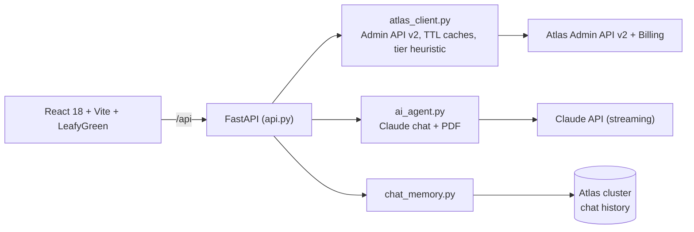

# Torre — Atlas Control Plane

One screen for a whole MongoDB Atlas fleet, with a Claude assistant grounded in the real clusters — not generic MongoDB trivia. Ask whether an M30 is enough and it answers from *your* p95 CPU.

Everything comes from the Atlas Admin API v2. UI is in pt-BR; code and docs in English.

## The demo in 5 steps

**1. Overview — the whole fleet in one snapshot.** Clusters, status, cost and alerts, without opening a dozen Atlas tabs.


**2. Health Score — one number, and where it came from.** 0–100 built from Performance Advisor, COLLSCAN shapes, cluster status and MongoDB version, with the points broken out per component.


**3. Scale — the tier answer, from data.** 24h CPU (p95/avg), memory, storage and connections, next to the cluster's native auto-scaling status and a tier simulator.


**4. FinOps — the bill next to the utilization.** Current invoice from the Billing API, estimated cost per cluster, and a verdict per row.


**5. AI Chat — grounded in the fleet.** Streaming Claude with the cluster context attached, history persisted in Atlas.


Note what it does in that screenshot: asked about 24h, it says it only has the last 5 minutes and shows how to get the rest, instead of making a number up.

Also on the menu: **Performance Advisor** (suggested indexes, one-click creation via pymongo, Claude analysis, PDF export), **Query Profiler** (parsed slow queries with a real `explain('executionStats')`) and **Compare** (two clusters side by side).

> Screenshots run against a live Atlas org; project and cluster names are replaced with neutral ones.

## How it fits together



Three deliberate choices:

- **Credentials never leave the backend.** The frontend only talks to `/api`.
- **The assistant is fenced in.** Scope is restricted to Atlas (an "M30" is a tier, never a Kubernetes cluster) and it must separate real API data from pattern-based recommendation.
- **Cheap to keep open.** Reused HTTP session, TTL caches, and Anthropic prompt caching on the static system block plus a ~2-minute cluster snapshot. Token spend shows at `GET /api/metrics`.

## Run it

Needs Python 3.10+, Node 18+, an [Atlas Admin API key](https://www.mongodb.com/docs/atlas/configure-api-access/) and an Anthropic key.

```bash
cp .env.example .env    # fill in the keys
./run_react.sh          # API :8765, UI :5290
```

```env
ATLAS_PUBLIC_KEY=
ATLAS_PRIVATE_KEY=
ATLAS_ORG_ID=
ANTHROPIC_API_KEY=
MONGODB_URI=                  # optional: index creation + chat history
CLAUDE_MODEL=claude-sonnet-5  # optional
API_AUTH_TOKEN=               # optional: protects the API
```

Override ports with `API_PORT=8770 WEB_PORT=5295 ./run_react.sh`.

Docker (nginx serves the build and proxies `/api`):

```bash
docker build -t torre . && docker run --env-file .env -p 18085:8080 torre
```

## Tests

```bash
python -m unittest discover -s tests -v
```

24 pure-logic tests — scaling heuristic, injection guards, chat-memory id validation. No credentials needed.

## Layout

```
api.py              FastAPI routes, middleware, auth
atlas_client.py     Admin API v2 client + scaling recommendations
ai_agent.py         Claude analysis, chat, PDF (streaming)
chat_memory.py      Chat history in Atlas
observability.py    Structured logs + /api/metrics
frontend/src/pages/ One component per page
```

## Credits

Based on Maestro by [Carime](https://github.com/carimeb) ([maestro-atlas-landing-zone](https://github.com/carimeb/maestro-atlas-landing-zone)).

MIT — see [LICENSE](LICENSE).
