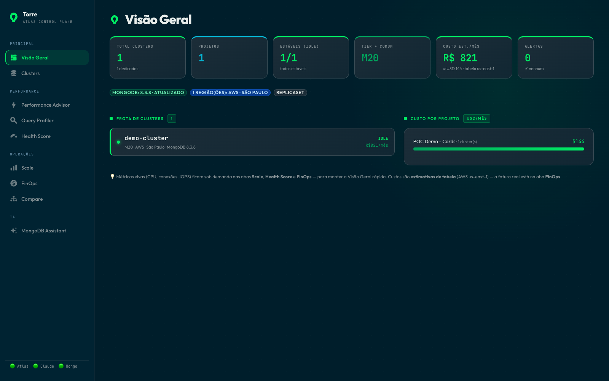
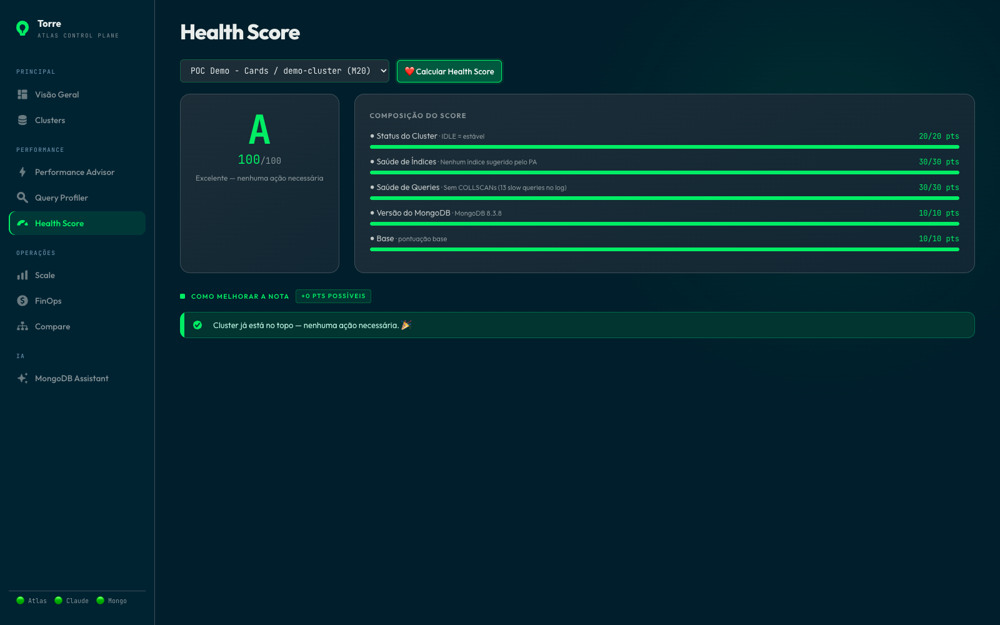
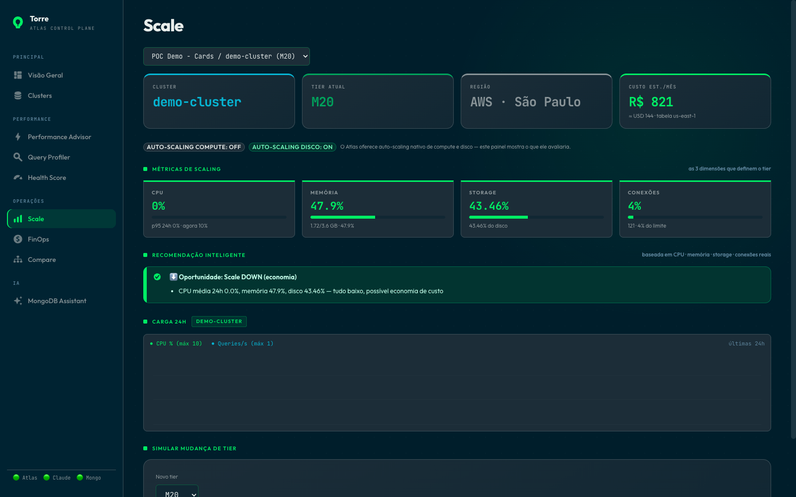
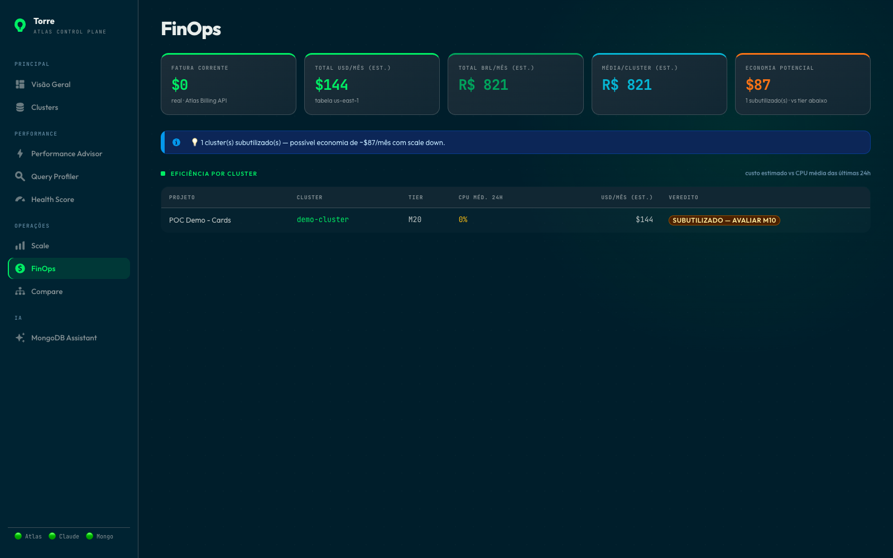
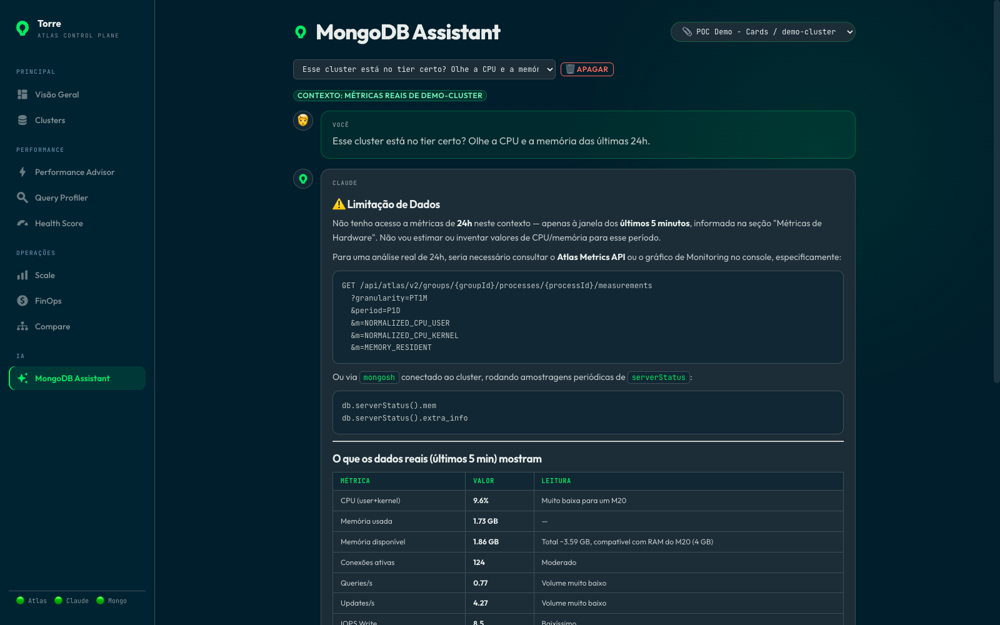
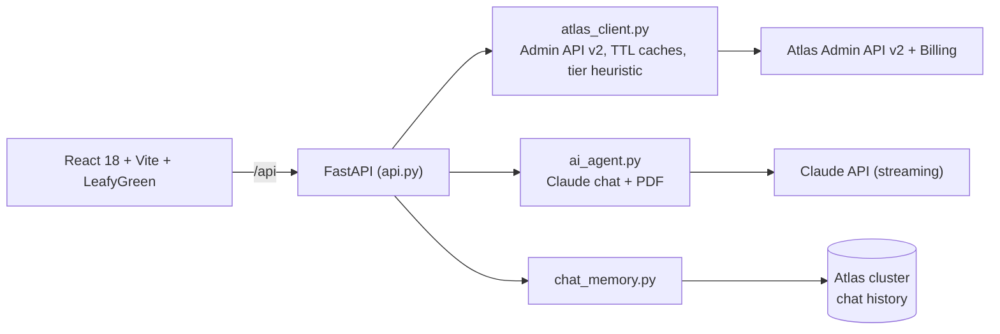

# Torre — Atlas Control Plane

Uma tela para uma frota inteira de MongoDB Atlas, com um assistente Claude ancorado nos clusters reais — e não em trivialidades genéricas sobre MongoDB. Pergunte se um M30 é suficiente e ele responde a partir do p95 de CPU *do seu* cluster.

Tudo vem da Atlas Admin API v2. A UI é em pt-BR; a documentação também, e o código segue em inglês.

## A demo em 5 passos

**1. Overview — a frota inteira em um instantâneo.** Clusters, status, custo e alertas, sem abrir uma dúzia de abas do Atlas.



**2. Health Score — um número, e de onde ele veio.** De 0 a 100, montado a partir do Performance Advisor, de shapes com COLLSCAN, do status do cluster e da versão do MongoDB, com os pontos abertos por componente.



**3. Scale — a resposta sobre o tier, a partir do dado.** CPU de 24h (p95/média), memória, armazenamento e conexões, ao lado do status nativo de auto-scaling do cluster e de um simulador de tier.



**4. FinOps — a conta ao lado da utilização.** Fatura atual pela Billing API, custo estimado por cluster e um veredito por linha.



**5. Chat de IA — ancorado na frota.** Claude em streaming com o contexto do cluster anexado e histórico persistido no Atlas.



Repare no que ele faz nesse screenshot: perguntado sobre 24h, ele diz que só tem os últimos 5 minutos e mostra como obter o resto, em vez de inventar um número.

Também no menu: **Performance Advisor** (índices sugeridos, criação em um clique via pymongo, análise pelo Claude, exportação em PDF), **Query Profiler** (queries lentas parseadas com um `explain('executionStats')` real) e **Compare** (dois clusters lado a lado).

> Os screenshots rodam contra uma organização Atlas real; os nomes de projeto e cluster foram trocados por nomes neutros.

## Como as peças se encaixam



Três escolhas deliberadas:

- **Credenciais nunca saem do backend.** O frontend só conversa com `/api`.
- **O assistente é cercado.** O escopo é restrito ao Atlas (um "M30" é um tier, nunca um cluster Kubernetes) e ele precisa separar dado real da API de recomendação baseada em padrão.
- **Barato de manter aberto.** Sessão HTTP reaproveitada, caches com TTL e cache de prompt da Anthropic sobre o bloco estático de sistema, mais um snapshot de cluster de ~2 minutos. O gasto de tokens aparece em `GET /api/metrics`.

## Como rodar

Precisa de Python 3.10+, Node 18+, uma [chave da Atlas Admin API](https://www.mongodb.com/docs/atlas/configure-api-access/) e uma chave da Anthropic.

```bash
cp .env.example .env    # preencha as chaves
./run_react.sh          # API :8765, UI :5290
```

O launcher usa backend sem reload e build otimizado do frontend por padrão. Para desenvolver com reload/HMR, rode `POV_DEV=1 ./run_react.sh`; o build só é refeito quando fontes, lockfile ou configuração mudam.

```env
ATLAS_PUBLIC_KEY=
ATLAS_PRIVATE_KEY=
ATLAS_ORG_ID=
ANTHROPIC_API_KEY=
MONGODB_URI=                  # opcional: criação de índices + histórico de chat
CLAUDE_MODEL=claude-sonnet-5  # opcional
API_AUTH_TOKEN=               # obrigatório quando exposto além do localhost
```

Sobrescreva as portas com `API_PORT=8770 WEB_PORT=5295 ./run_react.sh`.

Docker (nginx serve o build e faz proxy de `/api`):

```bash
docker build -t torre . && docker run --env-file .env -p 18085:8080 torre
```

## Testes

```bash
python -m unittest discover -s tests -v
```

27 testes de lógica pura — heurística de escala, guardas contra injeção em índices/caminhos, validação de id da memória de chat. Sem necessidade de credenciais.

## Fronteira de produção

Defina um `API_AUTH_TOKEN` longo e aleatório; ele protege as rotas da API e as métricas, enquanto o liveness continua público. Erros do Atlas são logados no servidor e sanitizados para os clientes, e definições de índice aceitam apenas um campo/direção seguro por chave. A imagem roda como UID 10001 atrás do nginx com cabeçalhos de segurança. Em ambientes compartilhados, prefira um IdP/API gateway real e saída privada até o Atlas.

## Organização

```
api.py              rotas FastAPI, middleware, autenticação
atlas_client.py     cliente da Admin API v2 + recomendações de escala
ai_agent.py         análise pelo Claude, chat, PDF (streaming)
chat_memory.py      histórico de chat no Atlas
observability.py    logs estruturados + /api/metrics
frontend/src/pages/ um componente por página
```

## Créditos

Baseado no Maestro, de [Carime](https://github.com/carimeb) ([maestro-atlas-landing-zone](https://github.com/carimeb/maestro-atlas-landing-zone)).

MIT — veja a [LICENSE](LICENSE).
