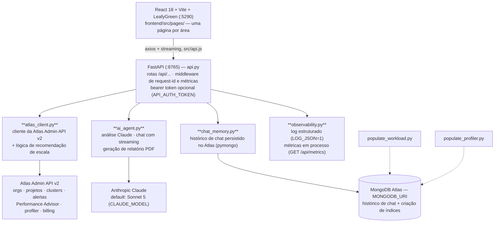
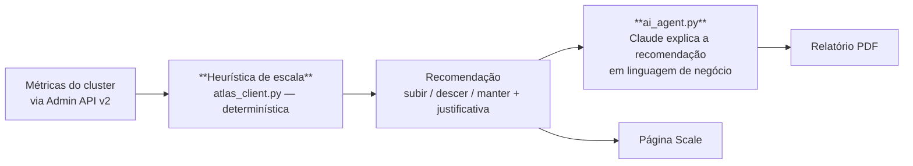

# Torre — Atlas Control Plane

Dashboard operacional para frotas MongoDB Atlas, com um assistente Claude embutido. React 18 + Vite + LeafyGreen no front, FastAPI no back envolvendo a **Atlas Admin API v2** e o Claude.

A ideia: quem opera várias organizações e projetos Atlas passa o dia navegando entre telas da UI do Atlas para responder perguntas simples — *quais clusters estão superdimensionados? o que o Performance Advisor está apontando? quanto isso está custando?*. O Torre consolida isso numa tela e deixa perguntar em linguagem natural, com o modelo enxergando os dados reais da Admin API.

UI em pt-BR por decisão (público brasileiro). Código-fonte, comentários e documentação em inglês.

---

## 1. Arquitetura

```
React 18 + Vite (frontend/) --proxy /api--> FastAPI (api.py) --> atlas_client / ai_agent / chat_memory --> MongoDB Atlas Admin API v2
```



---

## 2. As páginas

Uma componente por página em `frontend/src/pages/`:

| Página | O que responde |
|---|---|
| **Overview** | Estado da frota inteira numa tela |
| **Clusters** | Inventário: tier, região, versão, storage, auto-scaling |
| **PerformanceAdvisor** | O que o Atlas está recomendando de índice, por cluster |
| **Profiler** | Queries lentas, padrões de acesso |
| **Health** | Alertas ativos e estado operacional |
| **Scale** | Recomendação de escala — a heurística de `atlas_client.py` |
| **FinOps** | Custo por cluster/projeto, e onde está o desperdício |
| **Compare** | Comparação lado a lado entre clusters |
| **Chat** | Assistente Claude com streaming, sobre os dados reais da Admin API |

---

## 3. Recomendação de escala

A lógica vive em `atlas_client.py` e é **determinística e testada** (`tests/` tem suíte unittest para a heurística). Não é o modelo chutando tier.



A separação importa: **o número vem da heurística; o modelo escreve a justificativa.** Isso mantém a recomendação auditável e reprodutível, e usa o LLM no que ele é bom — traduzir métrica em argumento para quem paga a conta.

---

## 4. Assistente Claude

`ai_agent.py` faz três coisas:

- **Análise** — interpreta o estado de custo/performance/status vindo da Admin API.
- **Chat com streaming** — resposta token a token na página Chat.
- **Geração de relatório PDF** — o output que vai para a reunião.

O histórico do chat é persistido no Atlas via `chat_memory.py` (pymongo). A suíte de testes cobre **guardas de injeção** e **validação de id** no `chat_memory` — as duas superfícies onde entrada de usuário toca o banco.

---

## 5. Segurança

- **Credenciais vivem só no `.env` do backend. O frontend nunca as vê.** A chave da Atlas Admin API dá poder administrativo sobre a organização inteira — ela não pode passar por um bundle de browser em nenhuma circunstância.
- Autenticação por bearer token **opcional** via `API_AUTH_TOKEN`. Para uso além de local, ligar.
- Guardas de injeção e validação de id no `chat_memory`, cobertos por teste.

---

## 6. Frontend

O Torre é um dashboard de operação: quem olha é DBA, SRE ou quem paga a fatura do Atlas. Isso define o tom da tela — densidade de informação em vez de espaço em branco, e número sempre com a fonte ao lado.

Duas regras que valem para tudo:

1. **O frontend nunca vê credencial.** A chave da Admin API dá poder administrativo sobre a organização inteira. Ela fica no `.env` do backend, ponto. O browser só fala com `/api`.
2. **A tela não calcula recomendação.** O tier sugerido sai da heurística determinística do `atlas_client.py`. O React exibe o resultado e a justificativa — não reimplementa a regra.

### 6.1 Stack

| Item | Escolha | Motivo |
|---|---|---|
| Build | Vite, portas por env (`WEB_PORT` 5290, `API_PORT` 8765) | Máquina roda várias POCs; as portas precisam ser configuráveis sem editar código |
| UI kit | LeafyGreen | É um painel de operação Atlas — usar o design system do MongoDB é o mínimo |
| Estado | `useState` no `App.jsx` | Nove páginas, cada uma busca o próprio dado. Não há estado global de verdade |
| Navegação | Estado `active` + sidenav | Sem router. Não vale a dependência |
| HTTP | `axios` com `baseURL: '/api'` e timeout de 60s | Admin API é lenta; 60s é medido, não chute |
| Markdown | `react-markdown` + `remark-gfm` | As respostas do Claude vêm em markdown com tabela |

Duas coisas resolvidas no `vite.config.js` e que valem registro:

- **`nodePolyfills`** para `Buffer`/`global`/`process` — dependências transitivas do LeafyGreen (`readable-stream`, `through`) usam globais do Node que não existem no browser.
- **`manualChunks`** separando `leafygreen`, `markdown` e `vendor`. Sem isso o bundle único passa de 500 kB e dispara warning de build. Com a separação, o cache do browser também aproveita melhor entre deploys.

### 6.2 Contrato com o backend

Todo acesso passa por `src/api.js`, uma função por endpoint. O token opcional (`API_AUTH_TOKEN`) entra como header no cliente axios.

| Grupo | Funções | Endpoints |
|---|---|---|
| Frota | `getConfig`, `getClusters`, `getAlerts`, `getInvoice` | `/config`, `/clusters`, `/alerts`, `/invoice` |
| Por cluster | `getPA`, `getSlow`, `getMeasurements`, `getSeries`, `getHealth` | `/cluster/{project_id}/{cluster_name}/…` |
| Escala | `getScaling`, `scaleCluster` | `/scaling` (GET), `/scale` (POST) |
| Otimização | `explainQuery`, `createIndex` | `/explain`, `/index` |
| FinOps | `getFinops` | `/finops` |
| Chat | `streamChat`, `streamAnalyze`, `listConversations`, `getConversation`, `deleteConversation` | `/chat`, `/analyze`, `/chat/conversations/…` |
| Relatório | `downloadReport` | `/report` |

O par `project_id` + `cluster_name` é a chave em quase toda rota — `_picker.jsx` é o seletor compartilhado que garante que as páginas falam do mesmo cluster.

**`scaleCluster` é o único ponto do frontend que muda estado no Atlas de verdade.** Está isolado numa função só justamente por isso: qualquer revisão de segurança tem um lugar único pra olhar.

### 6.3 Streaming do chat

`axios` cuida dos GETs, mas as duas rotas de streaming (`/chat`, `/analyze`) usam `fetch` cru com `getReader()`, porque `axios` não expõe `ReadableStream` no browser. O texto é acumulado e entregue por callback, então a página Chat renderiza markdown parcial enquanto o token chega.

`downloadReport` também usa `fetch` — a resposta é um PDF binário, não JSON.

Histórico de conversa fica no Atlas (`chat_memory.py`). A UI lista, abre e apaga conversa. Os testes do backend cobrem guarda de injeção e validação de id nessas rotas, que são exatamente onde entrada de usuário toca o banco.

### 6.4 As páginas e o que cada uma precisa provar

| Página | Precisa deixar visível |
|---|---|
| **Overview** | A frota inteira numa tela, sem scroll — é o primeiro slide da conversa |
| **Clusters** | Tier, região, versão, storage e auto-scaling reais, direto da Admin API |
| **PerformanceAdvisor** | Recomendação do próprio Atlas, com o botão de criar índice ao lado |
| **Profiler** | Query lenta com o `explain` do lado, não só o tempo |
| **Health** | Alertas abertos e o score, com os problemas que o compõem |
| **Scale** | O número da heurística **e** a justificativa escrita pelo Claude, separados na tela |
| **FinOps** | Custo por cluster e onde está o desperdício |
| **Compare** | Dois clusters lado a lado, mesma métrica na mesma linha |
| **Chat** | Resposta em streaming sobre dado real da Admin API, com histórico persistido |

Na página Scale a separação entre número e texto é literal na diagramação. É o que sustenta a resposta pra pergunta que sempre vem: "esse tier aí foi o modelo que chutou?" Não — o modelo escreveu o parágrafo, a heurística deu o número, e há teste unitário cobrindo a heurística.

### 6.5 Build

```bash
cd frontend && npm run dev       # :5290, proxia /api -> :8765
cd frontend && npm run build
cd frontend && npm run preview   # preview também com proxy configurado
```

`strictPort: false` de propósito aqui — diferente de outras POCs do workspace, o Torre pode subir em porta alternativa sem quebrar nada, já que o alvo do proxy vem de `API_PORT` e não da porta do próprio dev server.

---

## 7. Como rodar

```bash
./run_react.sh   # ativa a venv, instala dependências se preciso,
                 # acha portas livres, sobe backend + frontend
```

Portas default: **8765** (API) e **5290** (UI). Sobrescrever com `API_PORT` / `WEB_PORT`.

### Frontend isolado (de `frontend/`)
```bash
npm run dev
npm run build
npm run preview
```

### Backend isolado
```bash
uvicorn api:app --reload   # venv ativada, .env preenchido
```

### Testes
```bash
python -m unittest discover -s tests -v   # sem credenciais Atlas/Mongo — só lógica pura e guardas
```

### Docker (container único — nginx serve o build e proxia `/api` para o FastAPI)
```bash
docker build -t torre .
docker run --env-file .env -p 8080:8080 torre
```

Não há linter configurado neste repositório.

### Dados de exemplo
```bash
python populate_workload.py    # semeia workload de exemplo
python populate_profiler.py    # semeia dados de profiler
```

---

## 8. Ambiente

Copiar `.env.example` para `.env`:

| Variável | Obrigatória | Papel |
|---|---|---|
| `ATLAS_PUBLIC_KEY` | Sim | Chave pública da Atlas Admin API |
| `ATLAS_PRIVATE_KEY` | Sim | Chave privada |
| `ATLAS_ORG_ID` | Sim | Organização a inspecionar |
| `ANTHROPIC_API_KEY` | Sim | Assistente e relatórios |
| `MONGODB_URI` | Opcional | Criação de índices + histórico de chat |
| `CLAUDE_MODEL` | Opcional | Default: Sonnet 5 |
| `API_AUTH_TOKEN` | Opcional | Liga autenticação por bearer token |

---

## 9. Estrutura

Módulos Python planos na raiz:

| Arquivo | Papel |
|---|---|
| `api.py` | Backend FastAPI: todas as rotas `/api/...`, middleware de request-id e métricas, auth opcional |
| `atlas_client.py` | Cliente da Atlas Admin API v2 + heurística de recomendação de escala |
| `ai_agent.py` | Análise Claude, chat com streaming, geração de PDF |
| `chat_memory.py` | Histórico de chat no Atlas via pymongo |
| `observability.py` | Log estruturado (`LOG_JSON=1`), métricas em processo (`GET /api/metrics`) |
| `populate_workload.py`, `populate_profiler.py` | Scripts standalone de seed |
| `tests/` | unittest: heurística de escala, guardas de injeção, validação de id do `chat_memory` |
| `frontend/src/api.js` | Cliente axios + streaming |
| `frontend/src/App.jsx` | Shell e navegação |
| `frontend/src/pages/` | Uma componente por página |
| `frontend/src/styles.css` | Tokens de design MongoDB dark — mesma paleta dos outros PoVs do workspace (`--bg-primary`, `--accent`, `--text-pri/sec/muted`), tipografia Outfit / JetBrains Mono |

---

## 10. Roteiro de demonstração

1. **Overview.** A frota inteira numa tela — quantos projetos, quantos clusters, o que está alertando agora.
2. **Clusters + FinOps.** Onde está o dinheiro, e quais clusters estão fora de proporção com a carga.
3. **Scale.** Mostrar a recomendação. Deixar claro que o número é heurística determinística, não palpite de LLM.
4. **Performance Advisor + Profiler.** O que o Atlas já está apontando, consolidado por cluster em vez de espalhado por telas.
5. **Chat.** Perguntar em linguagem natural — "qual cluster me custa mais e está mais ocioso?". Resposta em streaming, sobre os dados reais da Admin API.
6. **Relatório PDF.** O artefato que sai da conversa e vai para a reunião de custo.

---

## 11. Fronteiras do PoV

- Somente leitura sobre a Admin API — o Torre analisa e recomenda, não executa mudança de tier.
- Autenticação desligada por padrão; feita para uso local do time de operação.
- Métricas de observabilidade são em processo, resetam no restart.
- Sem linter configurado.

---

## 12. Caminho para produção

| Item | No PoV | Em produção |
|---|---|---|
| Autenticação | `API_AUTH_TOKEN` opcional | SSO corporativo obrigatório — a chave da Admin API é poder administrativo sobre a org |
| Credenciais | `.env` do backend | Cofre gerenciado, com rotação |
| Escopo | Somente leitura | Se algum dia executar mudança de tier: aprovação humana explícita + trilha de auditoria, no padrão do FinScope |
| Métricas | Em processo | Exportadas para a stack corporativa |
| Frota | Uma `ATLAS_ORG_ID` | Multi-org, com RBAC por organização |
| Custo de LLM | Chamada por pergunta | Cache das análises recorrentes; o estado da frota não muda a cada minuto |
